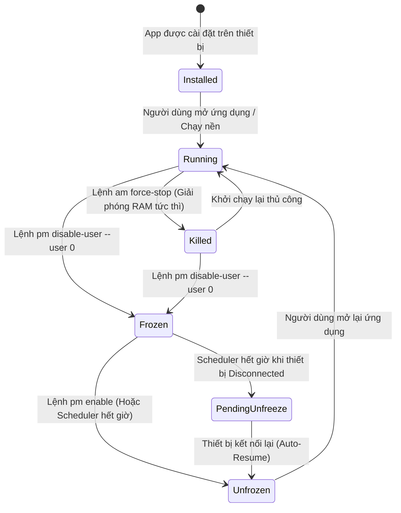
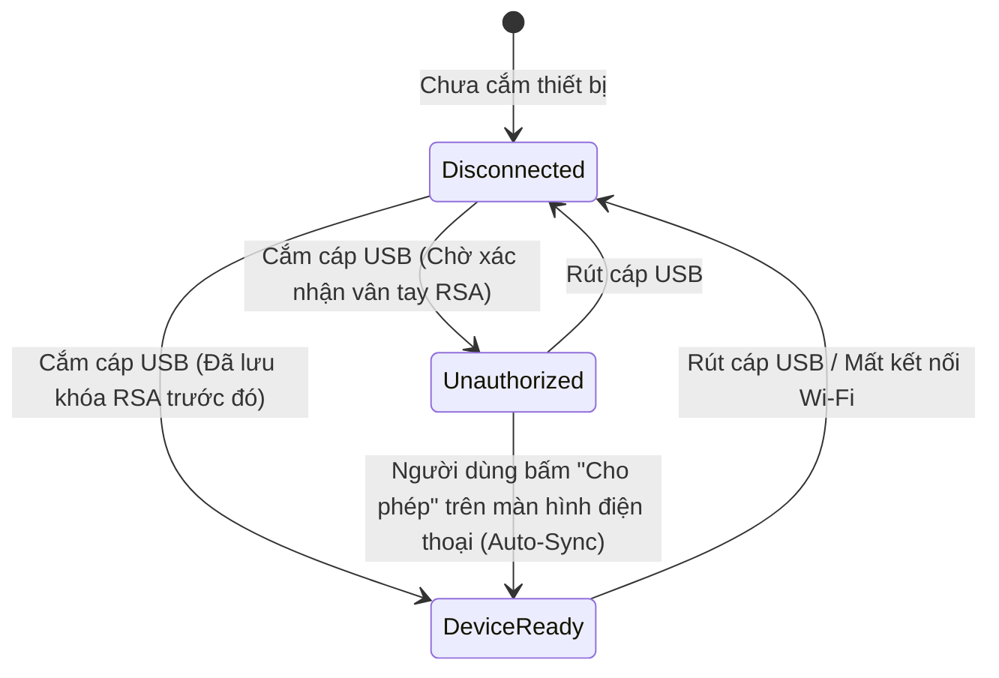

# DroidFrost - System Architecture & Technical Specifications

DroidFrost là giải pháp quản trị tài nguyên và tối ưu hóa thiết bị Android từ máy tính cá nhân (Desktop), hoạt động không cần quyền Root (Non-Root) thông qua giao thức Android Debug Bridge (ADB).

---

## 1. High-Level Architecture

Hệ thống được thiết kế theo kiến trúc phân lớp hướng module (Modular Layered Architecture), tối ưu hóa hiệu năng CPU/RAM và đảm bảo tốc độ phản hồi real-time:

```
+-----------------------------------------------------------------------+
|                        DESKTOP UI (Presentation)                      |
|             Svelte 5 / TypeScript / Vanilla Scoped CSS                |
|  - Reactive Dashboard (RAM/Swap/RAM Plus Visualizer)                  |
|  - Process Table (PSS/RSS Indicator, Filter, Batch Actions)           |
|  - Unauthorized Guide Modal & Auto-Sync Detector                      |
|  - Scheduler Tray & Notification Manager                              |
+-----------------------------------^-----------------------------------+
                                    | Tauri IPC (Events & Invocations)
+-----------------------------------v-----------------------------------+
|                        TAURI v2 BRIDGE LAYER                          |
|  - Async Commands (`get_devices`, `stop_all_running`, `freeze_app`...)|
|  - Event Emitter & Polling Guard (`refreshInFlight`)                  |
+-----------------------------------^-----------------------------------+
                                    | Rust Native Calls
+-----------------------------------v-----------------------------------+
|                         CORE RUST ENGINE                              |
|  +-----------------------------------------------------------------+  |
|  | DeviceDetectorService                                           |  |
|  | - USB Hotplug Watcher (Polling `adb devices -l`)                |  |
|  | - DeviceStatus Evaluator (`device` vs `unauthorized` vs `off`)  |  |
|  | - Wireless ADB Auto-Discovery & Pairing (Port 5555)             |  |
|  +-----------------------------------------------------------------+  |
|  | AdbExecutor                                                     |  |
|  | - Subprocess Command Pool, Timeout Guard 15s                    |  |
|  | - Command Sanitizer & Non-blocking Stream                       |  |
|  +-----------------------------------------------------------------+  |
|  | ProcessParser                                                   |  |
|  | - Direct `/proc/meminfo` parser (~30ms, RAM vật lý + Swap)      |  |
|  | - Section-isolated PSS Parser (Chống lặp OOM với `HashSet<u32>`)|  |
|  | - Fallback RSS Parser (`ps -A -o PID,NAME,RSS`)                 |  |
|  | - Categorizer: User App vs System App vs Safe Whitelist         |  |
|  +-----------------------------------------------------------------+  |
|  | ProcessController & Batch Engine                                |  |
|  | - Single Subprocess Shell Batch Execution (`am force-stop` chuỗi)| |
|  | - Persistent App Disable (`pm disable-user --user 0`)           |  |
|  +-----------------------------------------------------------------+  |
|  | FreezeSchedulerService                                          |  |
|  | - Asynchronous Queue with Priority Timer (Tokio runtime)        |  |
|  | - Local Persistence Engine (JSON storage)                       |  |
|  | - Disconnect Resilience Handler (Auto-Resume on reconnect)      |  |
|  +-----------------------------------------------------------------+  |
+-----------------------------------^-----------------------------------+
                                    | USB Cable / TCP-IP Port 5555
+-----------------------------------v-----------------------------------+
|                          ANDROID DEVICE                               |
|  - ADB Daemon (`adbd`) running as shell user                          |
|  - Linux Kernel Virtual File (`/proc/meminfo`)                        |
|  - ActivityManager (`am force-stop` batch execution)                  |
|  - PackageManager (`pm disable-user --user 0` / `pm enable`)          |
|  - Memory Dump (`dumpsys meminfo` / `ps RSS` fallback)                |
+-----------------------------------------------------------------------+
```

---

## 2. Process State Machine

Mỗi ứng dụng trên thiết bị Android được theo dõi dưới dạng một State Machine chặt chẽ:



### Các trạng thái:
1. **Running (Đang chạy):** Có PID trong bảng tiến trình hệ thống, chiếm giữ tài nguyên RAM/CPU.
2. **Killed (Đã buộc dừng):** Tiến trình đã bị hủy bằng `am force-stop`, dữ liệu trong bộ nhớ RAM được thu hồi ngay lập tức, nhưng ứng dụng vẫn có thể tự khởi động lại bởi push/broadcast receiver.
3. **Frozen (Đóng băng):** Ứng dụng bị vô hiệu hóa hoàn toàn bằng `pm disable-user --user 0`. Biểu tượng ứng dụng biến mất khỏi Launcher, không thể tự chạy ngầm, không tốn 1MB RAM nào.
4. **Scheduled (Đang hẹn giờ):** Ứng dụng đang trong danh sách đếm ngược để tự động rã đông hoặc đóng băng theo lịch định sẵn.
5. **Pending Unfreeze (Chờ rã đông):** Thiết bị bị ngắt kết nối khi đang hẹn giờ; trạng thái được lưu vào Local Store để kích hoạt lệnh unfreeze ngay khi thiết bị tái kết nối.

---

## 3. Disconnect Resilience & Auto-Resume Engine

Một trong những hạn chế lớn nhất của các ứng dụng ADB trên máy tính là rủi ro mất kết nối đột ngột (rút cáp USB hoặc mất mạng WiFi). DroidFrost giải quyết triệt để vấn đề này:

```
[Máy tính mất kết nối với Android]
                 │
                 ▼
[Scheduler ghi nhận timestamp mục tiêu vào Local Storage]
                 │
                 ▼
[Timer tiếp tục đếm nội bộ trên Desktop hoặc tạm ngưng nếu vượt quá mốc]
                 │
                 ▼
[Khi ADB phát hiện thiết bị cắm lại (Serial trùng khớp)]
                 │
                 ├─► Đối chiếu danh sách Scheduled Tasks
                 ├─► Nếu Thời gian hiện tại >= Thời gian hẹn:
                 │        Execute `pm enable <package>` ngay lập tức!
                 └─► Nếu Thời gian hiện tại < Thời gian hẹn:
                          Cập nhật lại delta time và tiếp tục bộ đếm.
```

---

## 4. Device State Machine & Unauthorized Auto-Sync

Hệ thống theo dõi trạng thái phần cứng của thiết bị qua luồng thăm dò ADB định kỳ:



- **Unauthorized Detection:** Khi thiết bị ở trạng thái `unauthorized`, giao diện hiển thị đèn vàng nhấp nháy (`pulse-warn`), đồng thời hiển thị màn hình hướng dẫn 3 bước trực quan.
- **Auto-Sync:** Bộ lắng nghe định kỳ (3s) tự động phát hiện ngay khi cờ chuyển sang `DeviceReady` để nạp RAM và tiến trình mà không cần thao tác thủ công từ người dùng.

---

## 5. Accurate Memory Architecture (`/proc/meminfo` + PSS Isolation)

DroidFrost áp dụng cơ chế đo lường bộ nhớ 2 cấp độ:

1. **Kernel-level System Memory (`/proc/meminfo`):**
   - Đọc trực tiếp từ tệp ảo Linux Kernel trong ~30ms (nhanh gấp 30 lần `dumpsys`).
   - Phân tách rõ ràng:
     * **RAM vật lý thực:** `MemTotal`
     * **RAM khả dụng:** `MemAvailable` (đã tính gộp bộ đệm và trang nhớ có thể thu hồi)
     * **Bộ nhớ ảo Swap / RAM Plus:** Bóc tách chính xác `SwapTotal` và `SwapUsed = SwapTotal - SwapFree`.
2. **Process-level Memory & Section PSS Isolation:**
   - Trích xuất dữ liệu từ `dumpsys meminfo`.
   - **Chống lặp OOM:** Android xuất hiện nhiều section (`Total RSS by process`, `Total RSS by OOM adjustment`, `Total PSS by process`, `Total PSS by OOM adjustment`). Bộ parser của DroidFrost cô lập riêng section `Total PSS by process:` và kết hợp bộ lọc `HashSet<u32>` theo PID để loại bỏ hoàn toàn hiện tượng nhân bốn RAM.
   - **Fallback Engine:** Trong trường hợp `dumpsys meminfo` bị từ chối, hệ thống tự động kích hoạt `ps -A -o PID,NAME,RSS` để đọc RSS thay thế.

---

## 6. Ultra-Fast Batch Execution Engine

Khi người dùng thực hiện *"Dừng tạm tất cả"* cho hàng chục ứng dụng:
- Thay vì gọi lệnh tuần tự qua từng tiến trình (gây độ trễ 3–5 giây qua socket ADB), DroidFrost gộp danh sách ứng dụng đã qua kiểm tra an toàn thành một chuỗi subprocess duy nhất:
  ```bash
  sh -c "am force-stop pkg1; am force-stop pkg2; am force-stop pkg3; ..."
  ```
- **Thời gian thực thi:** Giảm từ **3500ms** xuống chỉ còn **~100ms**, phản hồi gần như tức thì trên giao diện Desktop.

---

## 7. Security & Safety Whitelist Protocol

Hệ thống tích hợp quy tắc an toàn bảo vệ hệ điều hành (Safe-Guard):
- **Hardcoded System Whitelist:** Các gói dịch vụ cốt lõi của Android (`android`, `com.android.systemui`, `com.android.phone`, `com.android.providers.telephony`, `com.google.android.gms`) được bảo vệ hoàn toàn, ngăn chặn việc đóng băng nhầm gây treo máy (bootloop / soft-brick).
- **Graceful Fallback:** Trước khi thực hiện thao tác Freeze hoặc Kill hàng loạt ("One-Click Boost"), hệ thống luôn kiểm tra chéo với danh sách bảo vệ.
