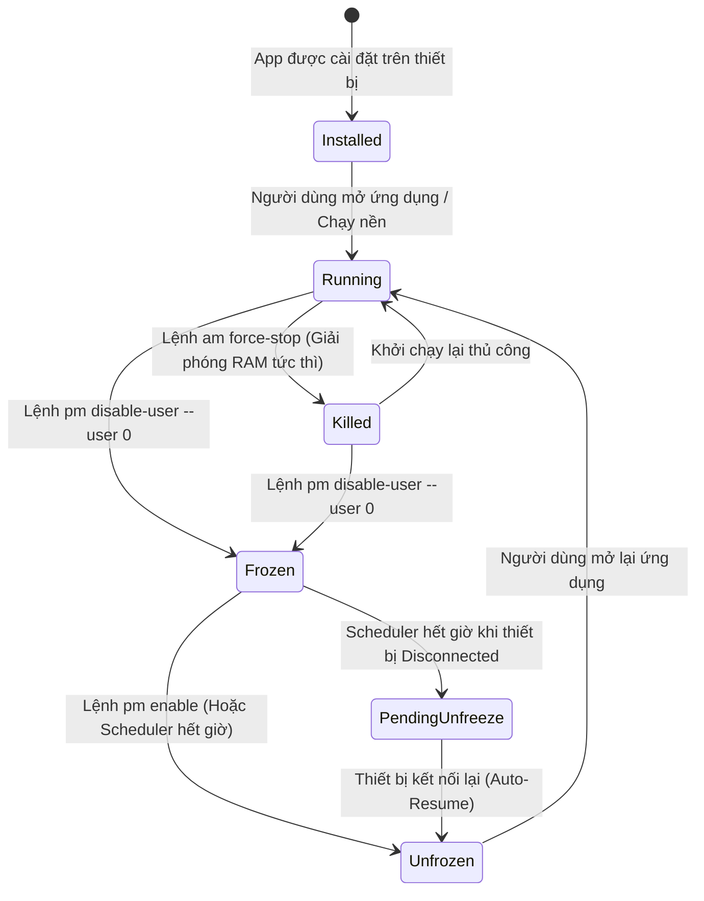

# DroidFrost - System Architecture & Technical Specifications

DroidFrost là giải pháp quản trị tài nguyên và tối ưu hóa thiết bị Android từ máy tính cá nhân (Desktop), hoạt động không cần quyền Root (Non-Root) thông qua giao thức Android Debug Bridge (ADB).

---

## 1. High-Level Architecture

Hệ thống được thiết kế theo kiến trúc phân lớp hướng module (Modular Layered Architecture), tối ưu hóa hiệu năng CPU/RAM và đảm bảo tốc độ phản hồi real-time:

```
+-----------------------------------------------------------------------+
|                        DESKTOP UI (Presentation)                      |
|             Svelte 5 / TypeScript / Tailwind-Free Scoped CSS           |
|  - Reactive Dashboard (RAM/CPU Visualizer)                           |
|  - Process Table (Virtual Scroll, Filter, Quick Actions)             |
|  - Scheduler Tray & Notification Manager                              |
+-----------------------------------^-----------------------------------+
                                    | Tauri IPC (Events & Invocations)
+-----------------------------------v-----------------------------------+
|                        TAURI v2 BRIDGE LAYER                          |
|  - Async Commands Handler (`get_devices`, `freeze_app`, ...)         |
|  - Event Emitter (`device_status_change`, `scheduler_tick`)           |
+-----------------------------------^-----------------------------------+
                                    | Rust Native Calls
+-----------------------------------v-----------------------------------+
|                         CORE RUST ENGINE                              |
|  +-----------------------------------------------------------------+  |
|  | DeviceDetectorService                                           |  |
|  | - USB Hotplug Watcher (Polling / ADB Track-Devices)             |  |
|  | - Wireless ADB Auto-Discovery & Status Evaluator                |  |
|  +-----------------------------------------------------------------+  |
|  | AdbExecutor                                                     |  |
|  | - Subprocess Command Pool, Timeout Guard & Non-blocking Stream   |  |
|  | - Command Sanitizer & Fail-safe Error Transformer               |  |
|  +-----------------------------------------------------------------+  |
|  | ProcessParser                                                   |  |
|  | - Zero-copy Regex Parser (`dumpsys meminfo`, `dumpsys activity`)|  |
|  | - Categorizer: User App vs System App vs Safe Whitelist         |  |
|  +-----------------------------------------------------------------+  |
|  | FreezeSchedulerService                                          |  |
|  | - Asynchronous Queue with Priority Timer                        |  |
|  | - SQLite / Local Persistence Engine                             |  |
|  | - Disconnect Resilience Handler                                 |  |
|  +-----------------------------------------------------------------+  |
+-----------------------------------^-----------------------------------+
                                    | USB Cable / TCP-IP Port 5555
+-----------------------------------v-----------------------------------+
|                          ANDROID DEVICE                               |
|  - ADB Daemon (`adbd`) running as shell user                          |
|  - ActivityManager (`am force-stop`)                                  |
|  - PackageManager (`pm disable-user --user 0` / `pm enable`)          |
|  - DumpServices (`dumpsys meminfo`, `dumpsys activity processes`)      |
+-----------------------------------------------------------------------+
```

---

## 2. Process State Machine

Mỗi ứng dụng trên thiết bị Android được theo dõi dưới dạng một State Machine chặt chẽ:



### Các trạng thái:
1. **Running (Đang chạy):** Có PID trong bảng tiến trình hệ thống, chiếm giữ tài nguyên RAM/CPU.
2. **Killed (Đã buộc dừng):** Tiến trình đã bị hủy bằng `am force-stop`, dữ liệu trong bộ nhớ RAM được thu hồi ngay lập tức, nhưng ứng dụng vẫn có thể tự khởi động lại bởi push/broadcast receiver.
3. **Frozen (Đóng băng):** Ứng dụng bị vô hiệu hóa hoàn toàn bằng `pm disable-user --user 0`. Biểu tượng ứng dụng biến mất khỏi Launcher, không thể tự chạy ngầm, không tốn 1MB RAM nào.
4. **Scheduled (Đang hẹn giờ):** Ứng dụng đang trong danh sách đếm ngược để tự động rã đông hoặc đóng băng theo lịch định sẵn.
5. **Pending Unfreeze (Chờ rã đông):** Thiết bị bị ngắt kết nối khi đang hẹn giờ; trạng thái được lưu vào Local Store để kích hoạt lệnh unfreeze ngay khi thiết bị tái kết nối.

---

## 3. Disconnect Resilience & Auto-Resume Engine

Một trong những hạn chế lớn nhất của các ứng dụng ADB trên máy tính là rủi ro mất kết nối đột ngột (rút cáp USB hoặc mất mạng WiFi). DroidFrost giải quyết triệt để vấn đề này:

```
[Máy tính mất kết nối với Android]
                 │
                 ▼
[Scheduler ghi nhận timestamp mục tiêu vào Local Storage]
                 │
                 ▼
[Timer tiếp tục đếm nội bộ trên Desktop hoặc tạm ngưng nếu vượt quá mốc]
                 │
                 ▼
[Khi ADB phát hiện thiết bị cắm lại (Serial trùng khớp)]
                 │
                 ├─► Đối chiếu danh sách Scheduled Tasks
                 ├─► Nếu Thời gian hiện tại >= Thời gian hẹn:
                 │        Execute `pm enable <package>` ngay lập tức!
                 └─► Nếu Thời gian hiện tại < Thời gian hẹn:
                          Cập nhật lại delta time và tiếp tục bộ đếm.
```

---

## 4. Security & Safety Whitelist Protocol

Hệ thống tích hợp quy tắc an toàn bảo vệ hệ điều hành (Safe-Guard):
- **Hardcoded System Whitelist:** Các gói dịch vụ cốt lõi của Android (`android`, `com.android.systemui`, `com.android.phone`, `com.android.providers.telephony`, `com.google.android.gms`) được bảo vệ hoàn toàn, ngăn chặn việc đóng băng nhầm gây treo máy (bootloop / soft-brick).
- **Graceful Fallback:** Trước khi thực hiện thao tác Freeze hoặc Kill hàng loạt ("One-Click Boost"), hệ thống luôn kiểm tra chéo với danh sách bảo vệ.
